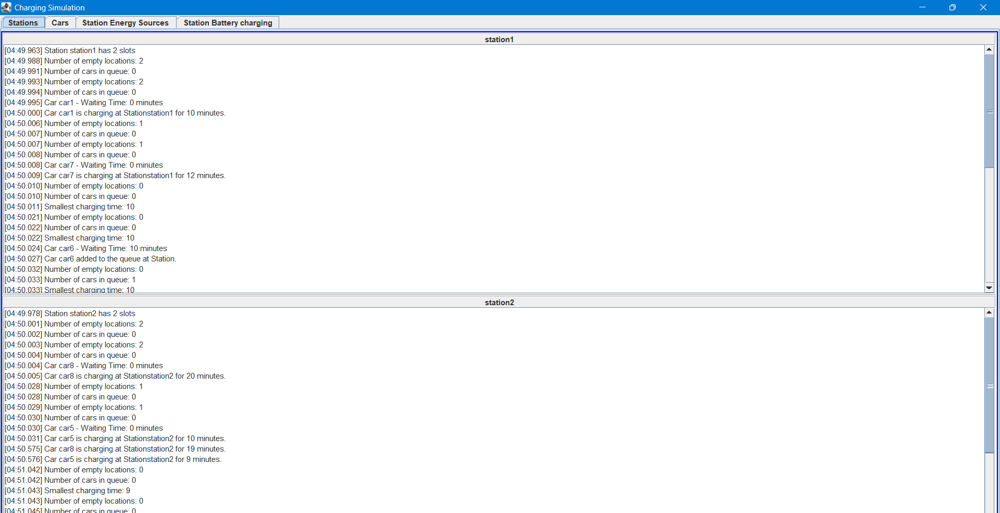
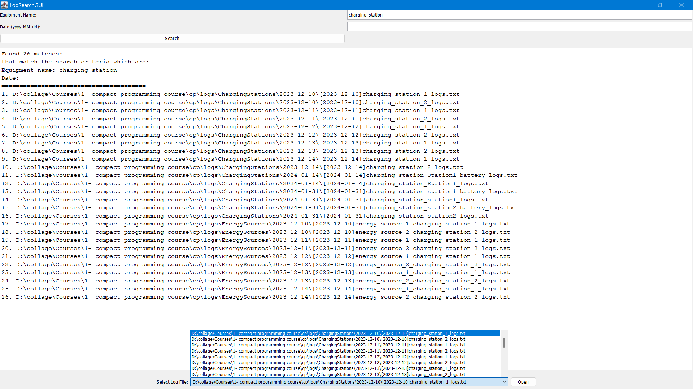

# running the application
run the Main.java file, it will start the application and 2 UI will be opened.
1. first UI for: the simulation of charging car.
   - 
2. second UI for: a search utility for the logs.
   - 
----
# team members:
1. Ahmed Hobeishy (7219053, MDT)
2. Varsha Vijayan (7216653 ,MDT)
3. Silpa Prasad Sivaprasad (7216655 ,MDT)
---
## Environment:
- Eclipse IDE
- Java 17
- JUnit 5

---

# Application Description

## ChargingStation and Cars

The `ChargingStation` and `Cars` are two fundamental entities in the car charging simulation. Here's a brief overview of each:

- **ChargingStation**: Each `ChargingStation` object represents a charging station in the simulation. It has properties such as station's ID, number of charging slots, and a list of `EnergySource` objects. The `ChargingStation` class has methods to add or remove energy sources, add a car to the station, and process charging cars. It also has a `StationWaitingQueue` object to manage the queue of cars waiting to enter the station.

- **Cars**: The `Car` class represents a car in the simulation. Each car has properties such as the car's ID, and charging speed. The `Car` class has methods to get the charging time and to check if the car is fully charged.

These classes interact with each other and with other classes in the simulation to simulate the process of charging electric cars at charging stations.

---

## Car Charging Simulation Logic

The car charging simulation logic is implemented in the `ChargingSimulator` class and it works as follows:

- **Initialization**: The simulation starts by loading the metadata for the charging stations and cars from CSV files. It also starts a weather simulation service that runs every 15 seconds.

- **UI Setup**: A `ChargingSimulationUI` instance is created and set up with the charging stations and cars. The number of available slots in each station and the charging time for each car are logged to the UI.

- **Car Charging**: For each car, the `chargeCar` method is called. This method creates a new thread for each car to simulate parallel charging.

- **Charging Attempt**: Inside the `chargeCar` method, the car attempts to charge at each station in a randomized order. If the station is full, the car tries the next one after waiting for 1 second. If all stations are full, the car waits for 5 seconds and tries again. This process continues until the car is successfully charged.

- **Station Processing**: Each `ChargingStation` object has a `processChargingCars` method that runs every second. This method checks each charging slot in the station. If a car is charging, it decreases the charging time. If the charging time reaches 0, the car leaves the station and the next car in the queue enters the station. If a slot is empty, the next car in the queue enters the station.

- **Queue Management**: The `StationWaitingQueue` class manages the queue of cars waiting to enter a station. When a car is added to the queue, its charging time is logged. When a car is removed from the queue, it is ready to be charged. The queue also calculates the total charging time for all cars in the queue.

---

## Car Queueing and Station Entry Logic

The decision for a car to enter the queue or station is made in the `ChargingSimulator` class, specifically in the `chargeCar` method. Here's how it works:

- **Attempt to Charge**: The car attempts to charge at each station in a randomized order. This randomization is done to ensure fairness and prevent any station from being consistently overloaded.

- **Station Full**: If a station is full (i.e., all charging slots are occupied & waiting time in the queue is larger than 15 minutes), the car tries the next station after waiting for 1 second. This wait time is implemented to simulate the real-world scenario where a car would need to travel to the next station.

- **All Stations Full**: If all stations are full, the car waits for 5 seconds and tries again. This process continues until the car is successfully charged or the car decides to leave due to long waiting times.

- **Waiting Time**: The waiting time for a car to enter a station is calculated in the `ChargingStation` class, specifically in the `getWaitingTimeForNextCar` method. If the waiting time is more than 15 minutes, the car will not enter the queue or the station and will switch to the next station. This is done to prevent cars from waiting too long to get charged.

- **Queue Entry**: If a station has no available slots but the waiting time is less than 15 minutes, the car is added to the station's queue. The car will enter the station once a slot becomes available.

This logic ensures that cars are distributed evenly across stations and that no car waits too long to get charged.

----

## Metadata Loading

In the car charging simulation, metadata is crucial for initializing the simulation. This metadata includes information about the charging stations and cars, and it is loaded from CSV files at the start of the simulation. Here's how it works:

- **Charging Stations Metadata**: The `ChargingStation` class has a `loadFromCSV` method that reads a CSV file containing information about the charging stations. Each row in the CSV file represents a charging station and includes information such as the station's ID, location, number of charging slots, and energy sources.

- **Cars Metadata**: The `Car` class also has a `loadFromCSV` method that reads a CSV file containing information about the cars. Each row in the CSV file represents a car and includes information such as the car's ID, model, battery capacity, and charging speed.

- **Metadata Loading**: The `ChargingSimulator` class calls these `loadFromCSV` methods during its initialization. It creates a list of `ChargingStation` and `Car` objects based on the loaded metadata. These objects are then used throughout the simulation.

This metadata loading process allows the simulation to be easily configured and customized based on the provided CSV files.

---

## Communication Inside the App

In the car charging simulation, the `WeatherService` and `ChargingStation` classes communicate indirectly through a shared file. Here's how it works:

- **WeatherService**: The `WeatherService` class simulates weather conditions that affect the energy production of the charging stations. Every 15 seconds, it generates new weather data and writes this data to a file. The weather data includes information such as sunlight intensity and wind speed, which affect the energy production of solar panels and wind turbines, respectively.

- **ChargingStation**: Each `ChargingStation` has a list of `EnergySource` objects, which can be solar panels, wind turbines, or other types of energy sources. The `ChargingStation` class reads the weather data from the file every 15 seconds and updates its `EnergySource` objects accordingly. For example, if the sunlight intensity is high, the energy production of solar panels increases. If the wind speed is low, the energy production of wind turbines decreases.

This file-based communication allows the `WeatherService` and `ChargingStation` classes to interact and update the energy production based on the simulated weather conditions.

---

## Logging System

The logging system in the car charging simulation is implemented using several classes. Here's a brief overview of each:

- **Logger**: The `Logger` class is the base class for all loggers in the system. It provides methods to log messages with different log levels (`INFO`, `WARNING`, `ERROR`), write logs to a file, and write logs to the console. It also provides methods to archive and delete old logs.

- **ChargingStationLogger**: The `ChargingStationLogger` class extends the `Logger` class. It is used to log messages related to a specific charging station. It also has a reference to the `ChargingSimulationUI` to update the UI with log messages.

- **EnergySourceLogger**: The `EnergySourceLogger` class extends the `Logger` class. It is used to log messages related to a specific energy source in a specific charging station. It also has a reference to the `ChargingSimulationUI` to update the UI with log messages.

- **SystemLogger**: The `SystemLogger` class extends the `Logger` class. It is used to log system-wide messages. It also has a reference to the `ChargingSimulationUI` to update the UI with log messages.

- **LogGenerator**: The `LogGenerator` class is used to generate test logs for the last x days. It uses the `Logger` class to create logs.

These classes work together to provide a comprehensive logging system for the car charging simulation.

### Daily Log Writing

In the car charging simulation, logs are written on a daily basis. This is handled by the `Logger` class. Here's how it works:

- **Log File Creation**: Each day, a new log file is created for each logger. The log file is named with the date of the logs and the name of the logger (e.g., `[2023-03-15]charging_station_1_logs.txt`). This is done in the `createFoldersAndFile` method of the `Logger` class.

- **Log Writing**: Throughout the day, log messages are written to the day's log file. Each log message is timestamped with the time it was logged. This is done in the `log` method of the `Logger` class.

- **Log Archiving and Deletion**: At the end of the day, the log file is archived and old logs are deleted. This is done in the `archiveLogs` and `deleteOldLogs` methods of the `Logger` class.

This daily log writing process ensures that logs are organized by date, making it easy to find and review logs for a specific day.

---

## Multi-User Access

In the car charging simulation, there are two types of users: `Admin` and `User`. Both of these users have the ability to interact with the `ChargingStation` and its `StationWaitingQueue`.

- **Admin**: The `Admin` class represents an administrator who has the ability to add or remove energy sources from a charging station. They can also add or remove cars from a station's waiting queue. This is done through the `addEnergySource`, `removeEnergySource`, `addCarToQueue`, and `removeCarFromQueue` methods.

- **User**: The `User` class represents a regular user who owns a car. They can add their car to a charging station's queue or remove it. This is done through the `addToQueue` and `removeFromQueue` methods.

This multi-user access allows for a realistic simulation of a car charging station, where different users have different levels of access and control.

---

