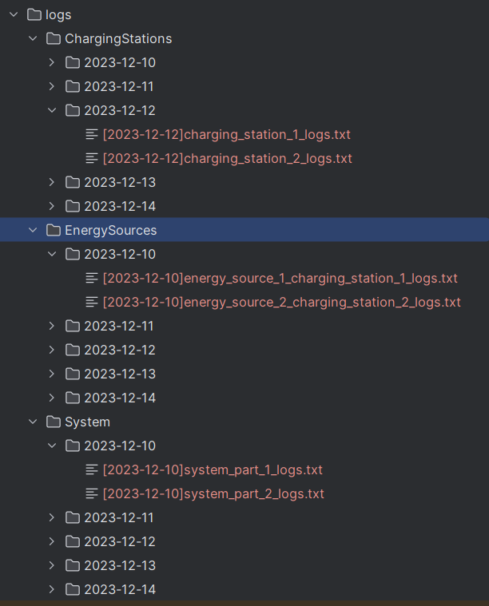

# Task 4 for compact programming course - java

## team members:

1. Ahmed Hobeishy (7219053, MDT)
2. Varsha Vijayan (7216653 ,MDT)
3. Silpa Prasad Sivaprasad (7216655 ,MDT)

## team responsibilities for task 4:

1. Ahmed Hobeishy
    - a base Logger that get the date of today and choose the folder and file to log to based on it
    - 3 sub loggers for each of the 3 classes that we need to log for
    - log generator that generates test logs for the last x days, so we can see how logs will look like after days of running the system

2. Silpa Prasad Sivaprasad
    - search utility that uses Regular expressions to search for the log file based on the name of the equipment or date
3. Varsha Vijayan
    - Command line interface that uses the search utility to search for the log file and open it in the default text editor

----
## running the solution:
1. run the `LogGenerator` class in the logging package to generate some logs
2. run the `LogSearchCLI` class in the logging package to search for the log file and open it in the default text editor
3. check the results you get is consistent with what we have in the logs folder
-----

## our solution (you can check the output in the logs folder):

we continued to use the same classes from task 3 and add the following logic:

1. ### for part 1 `Add logs files for each day for each charging station, for each energy source and for all system as whole.` we did the following:
    - we have a base Logger that get the date of today and choose the folder and file to log to based on it
    - we create 3 sub loggers for each of the 3 classes that we need to log for
        - ChargingStationLogger
            - log to the "logs/chargingStations" folder and create a file for each charging station
        - EnergySourceLogger
            - log to the "logs/energySources" folder and create a file for each energy source
        - SystemLogger
            - log to the "logs/system" folder and create a file for the different system parts
    - #### for testing:
        - we have the `LogGenerator` class
            - it generates test logs for the last x days, so we can see how logs will look like after days of running
              the
              system
            - **_to generate some logs, just run the log generator class in the logging package_**
    - #### results
    - 

----

1. ### for part 2 `Give user the possibility to open the requested log file based on the name of the equipment or date` we did the following:
    -  ### search utility that uses Regular expressions to search for the log file based on the name of the equipment or date
    - `LogSearchUtility` class is the one responsible for searching for the log file
        - it uses regular expressions to search for the log file based on the name of the equipment or date
          
    - ### Command line interface that uses the search utility to search for the log file and open it in the default text editor
        - `LogSearchCLI` class is the one responsible for the command line interface
            - it uses the search utility to search for the log file and open it in the default text editor
              
----

## Environment:
- Eclipse IDE
- Java 17
